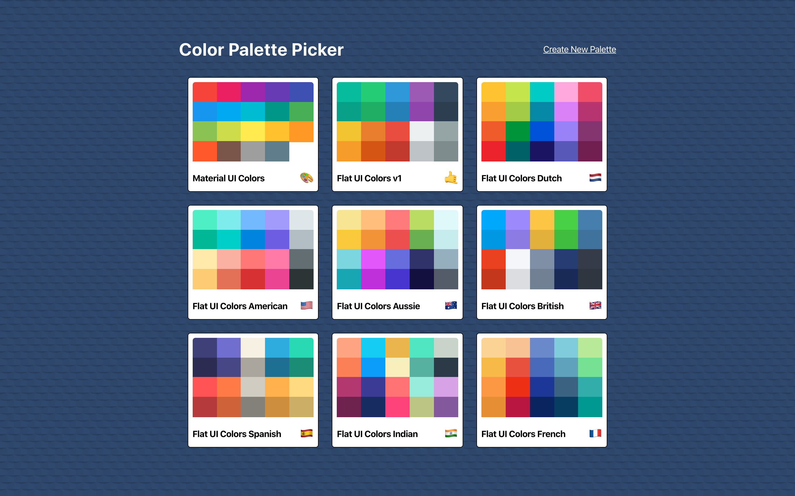

# Color Palette Picker

First a showcase of React Frontend, and second a functional tool for using and creating color palettes.

View the live instance here: https://color-palette-picker.netlify.com/

NPM dependencies:

    "@material-ui/core": "^4.8.3",
    "@material-ui/icons": "^4.5.1",
    "@material-ui/styles": "^4.8.2",
    "@testing-library/jest-dom": "^4.2.4",
    "@testing-library/react": "^9.4.0",
    "@testing-library/user-event": "^7.2.1",
    "chroma-js": "^2.1.0",
    "emoji-mart": "^2.11.2",
    "rc-slider": "^8.7.1",
    "react": "^16.12.0",
    "react-color": "^2.18.0",
    "react-copy-to-clipboard": "^5.0.2",
    "react-dom": "^16.12.0",
    "react-material-ui-form-validator": "^2.0.9",
    "react-router-dom": "^5.1.2",
    "react-scripts": "3.3.0",
    "react-sortable-hoc": "^1.10.1",
    "react-transition-group": "^4.3.0"

**### `npm start`**

Runs the app in the development mode.

**### `npm run build`**

Builds the app for production to the `build` folder.

